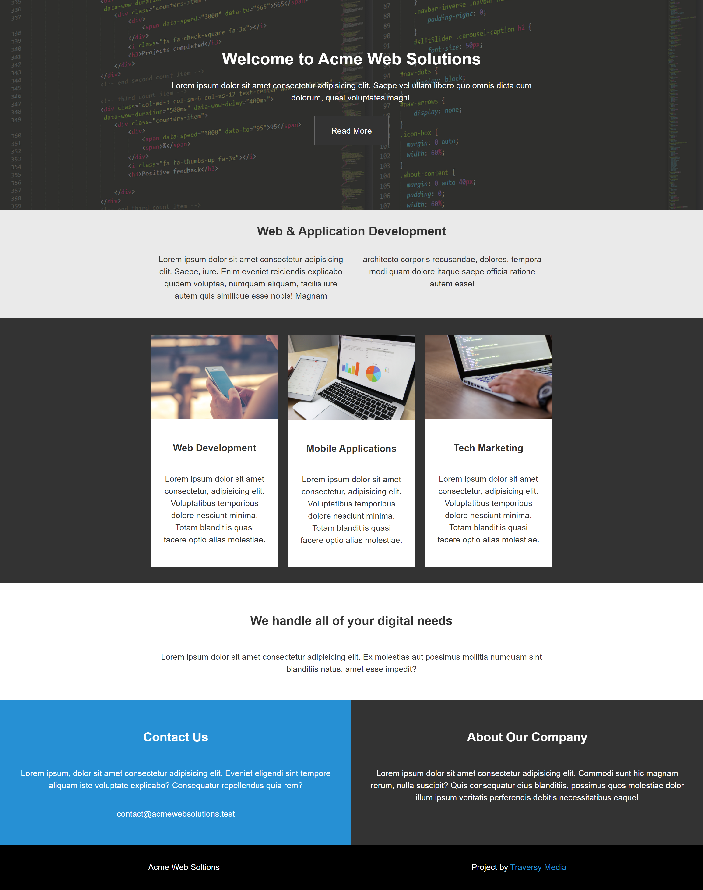

# Grid CSS Responsive Website Layout



### About

For this project we worked "mobile-first" and first built the project from a mobile-perspective, then added media queries for larger screens.

We used a Grid layout with fractional sections.

```
@media (min-width: 700px) {
  .grid {
    display: grid;
    grid-template-columns: 1fr repeat(2, minmax(auto, 25em)) 1fr;
  }

  #section-a .content-text {
    columns: 2;
    column-gap: 2em;
  }

  #section-a .content-text p {
    padding-top: 0;
  }

  .content-wrap,
  #section-b ul {
    grid-column: 2/4;
  }

  .box,
  #main-footer div {
    grid-column: span 2;
  }

  #section-b ul {
    display: flex;
    justify-content: space-around;
  }

  #section-b li {
    width: 31%;
  }
}


```

### Acknowledgement

Thanks to the greatest tutor on the planet Traversy Media for this great tutorial.
